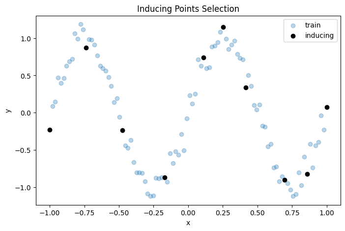

# Near-Optimal Approximations for Bayesian Inference in Function Space

## Abstract

We propose a scalable inference algorithm for Bayes posteriors defined on a reproducing kernel Hilbert space (RKHS). 
Given a likelihood function and a Gaussian random element representing the prior, we obtain the corresponding Bayes posterior measure $\pi^\*$ as the stationary distribution of an RKHS-valued Langevin diffusion. 
We approximate the infinite-dimensional Langevin diffusion via a projection onto the first $M$ components of the Kosambi–Karhunen–Loeve expansion. 
Exploiting the thus obtained approximate posterior for these $M$ components, we perform inference for $\pi^\*$ by relying on the law of total probability and a sufficiency assumption.
The resulting method scales as $\mathcal{O}(M^3 + JM^2)$, where $J$ is the number of samples produced from the posterior measure $\pi^\*$. 
Interestingly, the algorithm as a special case recovers the posterior arising from the sparse variational Gaussian process (SVGP) [(Titsias, 2009)](http://proceedings.mlr.press/v5/titsias09a/titsias09a.pdf) – owed to the fact that the sufficiency assumption underlies both methods. 
However, whereas the SVGP posterior is parametrically constrained to be a Gaussian process, our method is based on a variational family that can freely explore the space of all probability measures on $\mathbb{R}^M$ . 
Due to this additional flexibility, we can show that our method is provably close to the optimal $M$-dimensional variational approximation of the Bayesian posterior $\pi^*$ for convex and Lipschitz continuous negative log likelihoods and indeed coincides with SVGP for a Gaussian likelihood.

## Visualisations
To motivate the use of the Projected Langevin Sampling (PLS) algorithm, we provide some visualisations of the algorithm for different 1D tasks.
In the regression and classification visualisations below, we see that the particles are randomly initialised, but quickly converge to the data:

<p align="center">
  
</p>
<p align="center">
  
</p>

Unlike variational inference which restricts the model approximation class, PLS is a much more flexible framework. In the example below, we show that PLS can perfectly model a bimodal posterior with synthetic data for Poisson regression from an unknown rate function modelled as $f^2$. Variational approaches such as SVGP are limited by their Gaussian assumptions, making it difficult to model such data.

<p align="center">
  
</p>

PLS is also able to model the multimodality that arises from the uncertainty about the presence of an unknown constant shift.

<p align="center">
  
</p>

## Environment Installation

To set up the Python environment for this project, please follow the instructions below:

1. Install `poetry`

```shell
pip install poetry
```

2. Install dependencies (note that the `.lock` file is for CPU use)

```shell
poetry install
```

3. It may be necessary to set the `PYTHONPATH` environment variable to the root of the repository

```shell
export PYTHONPATH=$PWD
```

## Example Usage

This section demonstrates an example usage of the codebase. We will go through a full example of PLS for a simple 1D regression task. Our demo will involve the following steps:

1. <b>Data Generation</b>: generating some noisy data following a sin function,
2. <b>Inducing Points Selection</b>: selecting inducing points for our model using an ARD kernel,
3. <b>The Projected Langevin Sampling Model</b>: constructing our PLS model and initialising the particles,
4. <b>Function Space Gradient Flow</b>: performing the function space gradient flow to update the particles, and
5. <b>Tempering</b>: calibrating the model variance with a validation set.


### 0. Imports
We begin by importing some necessary modules:

```python
import gpytorch
import math
import torch

from typing import Tuple
import matplotlib.pyplot as plt

from src.utils import set_seed
set_seed(0)

# Enable 64 bit
torch.set_default_dtype(torch.float64)
```

### 1. Data Generation
For our example, we will generate some noisy data following a sin function:

```python
number_of_points = 100
observation_noise = 0.1
seed = 0

def func(x: torch.Tensor, seed: int, number_of_points: int) -> torch.Tensor:
    return torch.sin(2 * torch.pi * x.reshape(-1)) + observation_noise * torch.normal(
        mean=torch.tensor(0),
        std=torch.tensor(1),
        generator=torch.Generator().manual_seed(seed),
        size=(number_of_points,),
    ).reshape(-1)


# Generate data with noise
x = torch.linspace(-1, 1, number_of_points).reshape(-1, 1)
y = func(x, seed, number_of_points)
```

We can visualise the data below:

```python
def plot_train_data(
    fig: plt.Figure,
    ax: plt.Axes,
    x: torch.Tensor,
    y: torch.Tensor,
) -> Tuple[plt.Figure, plt.Axes]:
    ax.scatter(x, y, label="train", alpha=0.3, color="tab:blue")
    ax.set_xlabel("x")
    ax.set_ylabel("y")
    return fig, ax

fig, ax = plt.subplots(figsize=(8, 5))
fig, ax = plot_train_data(fig, ax, x, y)
ax.set_title("Train Data")
ax.legend()
plt.show()
```
<p align="center">
  
</p>

### 2. Inducing Points Selection
We now select the inducing points for our model. 
In this example, we use the greedy selection method from [Burt et al. (2020)](https://jmlr.org/papers/volume21/19-1015/19-1015.pdf). 
We do this by constructing an ARD kernel with the `gpytorch` library. For our example, we manually set the lengthscale and outputscale of the kernel. 

```python
from src.inducing_point_selectors import ConditionalVarianceInducingPointSelector

kernel = gpytorch.kernels.ScaleKernel(gpytorch.kernels.RBFKernel())
kernel.base_kernel.lengthscale = 0.15
kernel.outputscale = 3.0
inducing_point_selector = ConditionalVarianceInducingPointSelector()
x_induce, induce_indices = inducing_point_selector(
    x=x,
    m=int(math.sqrt(number_of_points)),
    kernel=kernel,
)
y_induce = y[induce_indices]

def plot_induce_data(
    fig: plt.Figure,
    ax: plt.Axes,
    x: torch.Tensor,
    y: torch.Tensor,
) -> Tuple[plt.Figure, plt.Axes]:
    ax.scatter(x, y, label="inducing", color="black")
    ax.set_xlabel("x")
    ax.set_ylabel("y")
    return fig, ax

fig, ax = plt.subplots(figsize=(8, 5))
fig, ax = plot_train_data(fig, ax, x, y)
fig, ax = plot_induce_data(fig, ax, x_induce, y_induce)
ax.set_title("Inducing Points Selection")
ax.legend()
plt.show()
```
<p align="center">
  
</p>


### 3. The Projected Langevin Sampling Model
We now construct the PLS model. This involves constructing the PLS kernel (kernel r in the paper), choosing a basis for our function space approximation, a cost function, and a link function. For this regression example, we use an orthonormal basis for our function space approximation, a Gaussian cost function, and an identity link function. Moreover, we must choose the observation noise for our Gaussian cost function. Having simulated the data, we know that the observation noise is 0.1, however we set it to 0.5 to demonstrate the tempering step later on.

```python
from src.projected_langevin_sampling import PLSKernel
from src.projected_langevin_sampling.basis import OrthonormalBasis
from src.projected_langevin_sampling.costs import GaussianCost
from src.projected_langevin_sampling.link_functions import IdentityLinkFunction
from src.projected_langevin_sampling import ProjectedLangevinSampling

pls_kernel = PLSKernel(
    base_kernel=kernel,
    approximation_samples=x_induce,
)
onb_basis = OrthonormalBasis(
    kernel=pls_kernel,
    x_induce=x_induce,
    x_train=x,
)
cost = GaussianCost(
    observation_noise=0.5,
    y_train=y,
    link_function=IdentityLinkFunction(),
)
pls = ProjectedLangevinSampling(
    basis=onb_basis,
    cost=cost,
)
```

Next, we initialise the particles. We can visualise the initial particles below:

```python
number_of_particles = 100
particles = pls.initialise_particles(
    number_of_particles=number_of_particles,
    seed=seed,
)
predicted_samples = pls.predict_samples(
    x=x,
    particles=particles,
).detach()

def plot_1d_particles(
    fig: plt.Figure,
    ax: plt.Axes,
    x: torch.Tensor,
    predicted_samples: torch.Tensor,
) -> Tuple[plt.Figure, plt.Axes]:
    for i in range(min(predicted_samples.shape[1], 20)):
        ax.plot(
            x.reshape(-1),
            predicted_samples[:, i].reshape(-1),
            color="black",
            alpha=0.15,
            zorder=0,
            label="particle" if i == 0 else None,
        )
    ax.set_xlabel("x")
    ax.set_ylabel("y")
    return fig, ax

fig, ax = plt.subplots(figsize=(8, 5))
fig, ax = plot_train_data(fig, ax, x, y)
fig, ax = plot_1d_particles(fig, ax, x, predicted_samples)
ax.set_title("Initialised Particles")
ax.legend()
plt.show()
```
<p align="center">
  
</p>

### 4. Function Space Gradient Flow
We now perform the function space gradient flow to update the particles. We can visualise the energy potential of the particles to keep track of the convergence of the algorithm. 

```python
number_of_epochs = 200
step_size = 1e-3
energy_potentials = []
for _ in range(number_of_epochs):
    particle_update = pls.calculate_particle_update(
        particles=particles,
        step_size=step_size,
    )
    particles += particle_update
    energy_potential = pls.calculate_energy_potential(particles=particles)
    energy_potentials.append(energy_potential)

fig, ax = plt.subplots(figsize=(8, 5))
plt.plot(torch.log(torch.tensor(energy_potentials)))
plt.title("Energy Potential")
plt.xlabel("epoch")
plt.ylabel("Log Energy Potential")
plt.show()
```
<p align="center">
  
</p>

Seeing that our energy potential has converged, we can visualise the updated particles below:

```python
predicted_samples = pls.predict_samples(
    x=x,
    particles=particles,
).detach()

fig, ax = plt.subplots(figsize=(8, 5))
fig, ax = plot_train_data(fig, ax, x, y)
fig, ax = plot_1d_particles(fig, ax, x, predicted_samples)
ax.set_title("Learned Particles")
ax.legend()
plt.show()
```
<p align="center">
  
</p>


### 5. Tempering
We see that the particles have converged to a reasonable approximation of the data, but the observation noise is still high.
We can fix this by tempering the model on a separate validation set. 
In practice this would be a held-out validation set but for the purposes of this example, we generate some new data from the same distribution as the training data. 
We can visualise the tempered prediction below:

```python
from src.temper import TemperPLS

def plot_prediction(
    fig: plt.Figure,
    ax: plt.Axes,
    x: torch.Tensor,
    prediction: gpytorch.distributions.MultivariateNormal,
) -> Tuple[plt.Figure, plt.Axes]:
    mean = prediction.mean.detach().numpy()
    stdev = torch.sqrt(prediction.covariance_matrix.diagonal()).detach().numpy()
    ax.plot(x, mean.reshape(-1), label="mean")
    ax.fill_between(
        x.reshape(-1),
        (mean - 1.96 * stdev).reshape(-1),
        (mean + 1.96 * stdev).reshape(-1),
        facecolor=(0.8, 0.8, 0.8),
        label="95% bound",
    )
    return fig, ax


x_validation = torch.linspace(-1, 1, number_of_points).reshape(-1, 1)
y_validation = func(x_validation, seed + 1, number_of_points)
tempered_pls = TemperPLS(
    x_calibration=x_validation, y_calibration=y_validation, pls=pls, particles=particles
)

prediction = tempered_pls(x)
fig, ax = plt.subplots(figsize=(8, 5))
fig, ax = plot_prediction(fig, ax, x, prediction)
fig, ax = plot_train_data(fig, ax, x, y)
ax.set_title("Tempered PLS")
plt.legend()
plt.show()
```
<p align="center">
  
</p>

We see that although we initialised the observation noise incorrectly, the tempering step is able to reasonably reduce the observation noise in our tempered prediction. We have now completed a full example of PLS for a simple 1D regression task!
